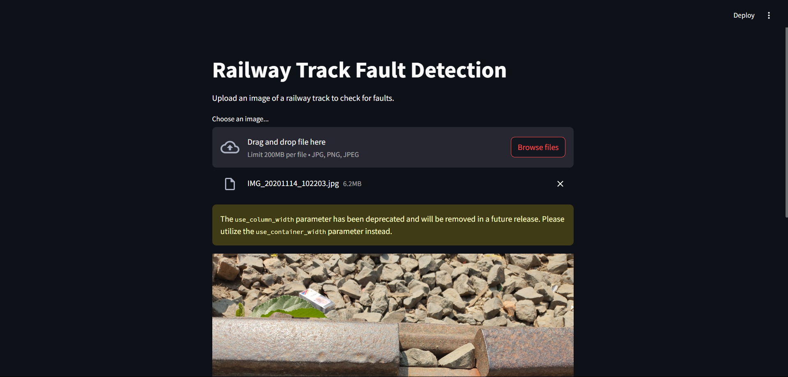

# Railway-track-fault-detection

This project implements a **Railway Track Fault Detection System** using **Streamlit** for the user interface and a **pre-trained CNN model (Inception V3)** for fault detection. The application allows users to upload railway track images and predicts whether the track is defective or non-defective.

Here's a sample of the UI:

---

## Features
- **Deep Learning Integration**: Powered by a pre-trained Inception V3 CNN model fine-tuned for railway track fault detection.
- **Interactive User Interface**: Built using Streamlit for seamless user interaction.
- **Real-time Predictions**: Processes uploaded images and provides instant results.
- **Automatic Image Preprocessing**: Resizes, normalizes, and prepares images for inference.

---

## Technologies Used
- **Python**: Core programming language for the application.
- **TensorFlow/Keras**: Framework used to load and run the trained CNN model.
- **Streamlit**: For building the web-based user interface.
- **Pillow (PIL)**: For image handling and preprocessing.
- **NumPy**: For numerical operations during preprocessing.

---

## How to Run the Application

### Prerequisites
Ensure you have the following installed:
- Python 3.8 or higher
- TensorFlow 2.x
- Streamlit
- Pillow (PIL)

### Installation Steps

1. Clone this repository: git clone https://github.com/yashhackz360/railway-track-fault-detection.git
cd railway-track-fault-detection
2. Install dependencies:  pip install -r requirements.txt
3. Place the trained model file (`railway_track_fault_model.keras`) in the specified directory:
4.  Run the application:  streamlit run train_fault_app.py

---

## Usage Instructions

1. Launch the application using Streamlit: streamlit run train_fault_app.py
2. Upload an image of a railway track in `.jpg`, `.png`, or `.jpeg` format.

3. View the prediction:
- ✅ **No Fault Detected**: Indicates the track is non-defective.
- ❌ **Fault Detected**: Indicates the track is defective.

4. The uploaded image will be displayed alongside the prediction result.

---

## Code Overview

### Model Loading
The Inception V3 pre-trained model is loaded using TensorFlow:

---

## Future Enhancements

1. **Model Optimization**: Improve accuracy by fine-tuning hyperparameters or using additional training data.
2. **Batch Processing**: Enable users to upload multiple images simultaneously for predictions.
3. **Cloud Deployment**: Deploy on platforms like AWS, Heroku, or Streamlit Cloud for broader accessibility.
4. **Mobile Interface**: Create a mobile-friendly version of the app.

---

## Contribution Guidelines

We welcome contributions to improve this project! To contribute:
1. Fork this repository.
2. Create a new branch (`feature-name`).
3. Submit a pull request with detailed descriptions of changes.

---

## License

This project is licensed under the MIT License. See `LICENSE` for more details.

---

## Acknowledgments

Special thanks to:
- TensorFlow/Keras community for providing robust tools for deep learning.
- Streamlit team for enabling rapid development of interactive applications.

---
📩 **Have queries? Let's connect:**   

